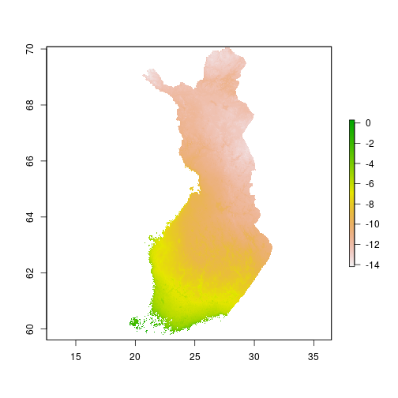

# Usage

## API key

In order to use the FMI API, you need to obtain a personal API key first.
To get the key, follow the instructions at <https://ilmatieteenlaitos.fi/rekisteroityminen-avoimen-datan-kayttajaksi>
(appears to be available only in Finnish).
Enter the API key from command line:

```r
apiKey <- "ENTER YOUR API KEY HERE"
#apiKey <- readLines("apikey.txt") # Or store the key in private file
```

## Available data sets and filtering

FMI provides a brief introduction to the data sets at <http://en.ilmatieteenlaitos.fi/open-data-sets-available>.
A complete list of the available data sets and filtering parameters are described in
<http://en.ilmatieteenlaitos.fi/open-data-manual-fmi-wfs-services>.
Each data set is referenced with a stored query id, for example the id for the daily weather time series
is `fmi::observations::weather::daily::timevaluepair`. This data set contains variables for
daily precipitation rate, mean temperature, snow depth, and minimum and maximum temperature,
see the description of [`fmi::observations::weather::daily::multipointcoverage`](http://en.ilmatieteenlaitos.fi/open-data-manual-fmi-wfs-services).
The data can be filtered with a number of parameters specific to each data set.
For example, the starting and the ending dates are provided by the `starttime` and `endtime`
parameters for the weather observations.

## Usage

### Request object

Queries to the FMI API are specified using an object of the class `FMIWFSRequest`. To initialize the object, type:

```r
library(fmi)
request <- FMIWFSRequest$new(apiKey=apiKey)
```

The fmi package provides two types of queries: a manual one for direct access to the FMI API and
an automated one for a convenient access obtaining the data sets.

In the manual case, stored query id and filter parameters are given with the `setParameters` method:

```r
request$setParameters(request="getFeature",
                      storedquery_id="fmi::observations::weather::daily::timevaluepair",
                      starttime="2014-01-01T00:00:00Z",
                      endtime="2014-01-01T00:00:00Z",
                      bbox="19.09,59.3,31.59,70.13",
                      parameters="rrday,snow,tday,tmin,tmax")
```
The parameter `request="getFeature"` must be specified always.

For the automated case, see below.

### Client object

Queries to the FMI API are made by using the `FMIWFSClient` class object. For example, a manual request is dispatched with
(continued from the previous example):

```r
client <- FMIWFSClient$new(request=request)
layers <- client$listLayers()
response <- client$getLayer(layer=layers[1], parameters=list(splitListFields=TRUE))
```
This example retrieves a list of data layers and the first layer is used to obtain the actual data. In fact, there is
only single layer.

For the same stored query, an automated request method, `getDailyWeather`, exists as well, which is a more
convenient way to retrieve the data. For example, to get all weather observations for the 1st of January in 2014:

```r
request <- FMIWFSRequest$new(apiKey=apiKey)
client <- FMIWFSClient$new(request=request)
response <- client$getDailyWeather(startDateTime="2014-01-01", endDateTime="2014-01-01", bbox=getFinlandBBox())
```
Here the function `getFinlandBBox` returns the bounding box surrounding the whole Finland.
See the package documentation in R for all available automated queries. Currently, the package supports only
a few data sets, which can be obtained using an automated query method. The rest of the stored queries are
available with the generic method `getLayer`.

As rgdal does not currently support direct queries to the FMI API, the client saves the response
to an intermedidate file first and then lets GDAL and rgdal to parse it. The `FMIWFSClient` class provides
a caching mechanism, so that the response is needed to be downloaded only once for the same subsequent queries.
The response file can be saved to a permanent location with the method `saveGMLFile` and loaded up into a
`FMIWFSClient` object again by referencing the file via a `GMLFile` object. GML files saved from the FMI API
directly can be loaded as well.

### Supported data and metadata

The fmi package supports time-value-pair and GRIB data formats. Multipoint-coverage format is not currently supported.
However, most of the multipoint-coverage data sets are availables in the time-value-pair format as well.

The automated queries attempt to associate appropriate metadata with the obtained data. The generic method `getLayer`
ignores the metadata and therefore it is left to the user to handle the metadata.
In case there is no documentation available, the metadata - or some of it - can be found from the actual XML
response retrieved from the FMI API. The XML response can be browsed by entering the query URL to a browser
or saving the response to a file first and then viewing it. A query URL can be printed from the request object
directly:

```r
request
```

For manual requests, coordinate reference system (if needed) must be specified manually by providing the `crs` argument
as a character string for the `getLayer` method. The default CRS appears to be WGS84. Furthermore, longitude and latitude
coordinates may need to be swapped, which can be done with the argument `swapAxisOrder=TRUE`. For example:

```r
response <- client$getLayer(layer="PointTimeSeriesObservation", crs="+proj=longlat +datum=WGS84", swapAxisOrder=TRUE, parameters=list(splitListFields=TRUE))
```
The last parameter `splitListFields=TRUE` asks the `ogr2ogr` tool bundled with the GDAL library
to convert the list fields to separate fields, so that rgdal can read the data properly.

### Redundant features

Some of the responses contain a redundant multipoint feature, which rgdal does not handle.
A workaround is to remove the feature using `ogr2ogr`.
In such case, `explodeCollections=TRUE` needs to be specified for the `getLayer` method, for example:

```r
response <- client$getLayer(layer="PointTimeSeriesObservation", parameters=list(explodeCollections=TRUE))
```

### Saving data and reading from file

Unprocessed data can be saved to a file with the `saveGMLFile` method and later processed by referencing
the file using a `GMLFile` object:

```r
request <- FMIWFSRequest$new(apiKey=apiKey)
client <- FMIWFSClient$new(request=request)
response <- client$getDailyWeather(startDateTime="2014-01-01", endDateTime="2014-01-02", bbox=getFinlandBBox())
tempFile <- tempfile()
client$saveGMLFile(destFile=tempFile)

request <- rwfs::GMLFile$new(tempFile)
client <- FMIWFSClient$new(request=request)
response <- client$getDailyWeather()
```

### Error handling

TODO

## Examples

### Manual request

Load the library:

```r
library(fmi)
```

Enter your API key for the examples:

```r
apiKey <- "ENTER YOUR API KEY HERE"
```

Construct a request object for the manual query:

```r
request <- FMIWFSRequest$new(apiKey=apiKey)
request$setParameters(request="getFeature",
                      storedquery_id="fmi::observations::weather::daily::timevaluepair",
                      starttime="2014-01-01",
                      endtime="2014-01-02",
                      bbox="19.09,59.3,31.59,70.13",
                      parameters="rrday,snow,tday,tmin,tmax")
```
The time parameters can be provided as objects that can be converted to the `POSIXlt` objects and
bbox as an `extent` object from the [`raster`](http://cran.r-project.org/web/packages/raster/index.html)
package as well.

Set up a client object and list the layers in the response:

```r
client <- FMIWFSClient$new(request=request)
layers <- client$listLayers()
```

```r
layers
```

```
## [1] "PointTimeSeriesObservation"
## attr(,"driver")
## [1] "GML"
## attr(,"nlayers")
## [1] 1
```

Parse the data from the response, which has been cached:

```r
response <- client$getLayer(layer=layers[1], crs="+proj=longlat +datum=WGS84", swapAxisOrder=TRUE, parameters=list(splitListFields=TRUE))
```

```r
library(sp)
head(cbind(coordinates(response), response@data[,c("name1","time1","result_MeasurementTimeseries_point_MeasurementTVP_value1","time2","result_MeasurementTimeseries_point_MeasurementTVP_value2")]))
```

```
##   coords.x2 coords.x1                           name1                time1
## 1  19.90344  60.12475 Jomala Maarianhamina lentoasema 2014-01-01T00:00:00Z
## 2  19.90344  60.12475 Jomala Maarianhamina lentoasema 2014-01-01T00:00:00Z
## 3  19.90344  60.12475 Jomala Maarianhamina lentoasema 2014-01-01T00:00:00Z
## 4  19.90344  60.12475 Jomala Maarianhamina lentoasema 2014-01-01T00:00:00Z
## 5  19.90344  60.12475 Jomala Maarianhamina lentoasema 2014-01-01T00:00:00Z
## 6  21.36783  59.78423                    Parainen Utö 2014-01-01T00:00:00Z
##   result_MeasurementTimeseries_point_MeasurementTVP_value1
## 1                                                      NaN
## 2                                                      NaN
## 3                                                      3.6
## 4                                                      2.8
## 5                                                      4.5
## 6                                                      0.3
##                  time2
## 1 2014-01-02T00:00:00Z
## 2 2014-01-02T00:00:00Z
## 3 2014-01-02T00:00:00Z
## 4 2014-01-02T00:00:00Z
## 5 2014-01-02T00:00:00Z
## 6 2014-01-02T00:00:00Z
##   result_MeasurementTimeseries_point_MeasurementTVP_value2
## 1                                                      NaN
## 2                                                      NaN
## 3                                                      3.8
## 4                                                      3.3
## 5                                                      4.3
## 6                                                     -1.0
```
The data is returned as a `SpatialPointsDataFrame` object in "wide" format so that there is a row for each
variable and observation location, but for each day (two days here) there are columns for time and observation
indexed with a sequential number. The columns starting with `time` contains the time and the columns
`result_MeasurementTimeseries_point_MeasurementTVP_value` the measurements, which are organized so that
the variables `rrday, snow, tday, tmin, tmax` are repeated in the same order as specified in the request. 

### Automated request

The method `getDailyWeather` provides an automated query for the daily weather time series:

```r
request <- FMIWFSRequest$new(apiKey=apiKey)
client <- FMIWFSClient$new(request=request)
response <- client$getDailyWeather(startDateTime="2014-01-01", endDateTime="2014-01-02", bbox=getFinlandBBox())
```

```r
head(cbind(coordinates(response), response@data[,c("name1","time","variable","measurement")]))
```

```
##   coords.x2 coords.x1                           name1       time variable
## 1  19.90344  60.12475 Jomala Maarianhamina lentoasema 2014-01-01    rrday
## 2  19.90344  60.12475 Jomala Maarianhamina lentoasema 2014-01-01     snow
## 3  19.90344  60.12475 Jomala Maarianhamina lentoasema 2014-01-01     tday
## 4  19.90344  60.12475 Jomala Maarianhamina lentoasema 2014-01-01     tmin
## 5  19.90344  60.12475 Jomala Maarianhamina lentoasema 2014-01-01     tmax
## 6  21.36783  59.78423                    Parainen Utö 2014-01-01    rrday
##   measurement
## 1         NaN
## 2         NaN
## 3         3.6
## 4         2.8
## 5         4.5
## 6         0.3
```
The automated method sets the known parameters automatically and returns cleaner result
by combining the data with metadata data and converting the "wide" format to long format.

### Raster

To request continuous space data manually, use the `getRaster` method, for instance:

```r
library(raster)
request <- FMIWFSRequest$new(apiKey=apiKey)
request$setParameters(request="getFeature",
                      storedquery_id="fmi::observations::weather::monthly::grid",
                      starttime="2012-01-01",
                      endtime="2012-01-01")
client <- FMIWFSClient$new(request=request)
response <- client$getRaster(parameters=list(splitListFields=TRUE))
```
The response is returned as a `RasterBrick` object of the `raster` package:

```r
response
```

```
## class       : RasterBrick 
## dimensions  : 1165, 1901, 2214665, 2  (nrow, ncol, ncell, nlayers)
## resolution  : 0.008996004, 0.008993226  (x, y)
## extent      : 15.96441, 33.06581, 59.60727, 70.08438  (xmin, xmax, ymin, ymax)
## coord. ref. : +proj=longlat +a=6371229 +b=6371229 +no_defs 
## data source : /tmp/RtmpjX4SIg/file3cae4d6dea6e 
## names       : file3cae4d6dea6e.1, file3cae4d6dea6e.2
```
Set the NA value and plot the interpolated monthly mean temperature in January 2012:

```r
NAvalue(response) <- 9999
plot(response[[1]])
```

 

There is also the automated request method `getMonthlyWeatherRaster` for obtaining monthly weather data:

```r
request <- FMIWFSRequest$new(apiKey=apiKey)
client <- FMIWFSClient$new(request=request)
response <- client$getMonthlyWeatherRaster(startDateTime="2012-01-01", endDateTime="2012-02-01")
```

The method sets the raster band names to match the variable name and the dates:

```r
names(response)
```

```
## [1] "MeanTemperature.2012.01.01" "MeanTemperature.2012.02.01"
## [3] "Precipitation.2012.01.01"   "Precipitation.2012.02.01"
```

## Licensing and further information

For the open data license, see <http://en.ilmatieteenlaitos.fi/open-data-licence>. Further information about
the open data and the API is provided by the FMI at <http://en.ilmatieteenlaitos.fi/open-data>.

## Citing the R package

This work can be freely used, modified and distributed under the
[Two-clause FreeBSD license](http://en.wikipedia.org/wiki/BSD\_licenses). Kindly cite the
R package as 'Jussi Jousimo et al. (C) 2014. fmi R package. URL: http://www.github.com/rOpenGov/fmi'.

## Session info

This tutorial was created with


```
## R version 3.2.0 (2015-04-16)
## Platform: x86_64-suse-linux-gnu (64-bit)
## Running under: openSUSE 20150530 (Tumbleweed) (x86_64)
## 
## locale:
##  [1] LC_CTYPE=en_US.UTF-8       LC_NUMERIC=C              
##  [3] LC_TIME=en_US.UTF-8        LC_COLLATE=en_US.UTF-8    
##  [5] LC_MONETARY=en_US.UTF-8    LC_MESSAGES=en_US.UTF-8   
##  [7] LC_PAPER=en_US.UTF-8       LC_NAME=C                 
##  [9] LC_ADDRESS=C               LC_TELEPHONE=C            
## [11] LC_MEASUREMENT=en_US.UTF-8 LC_IDENTIFICATION=C       
## 
## attached base packages:
## [1] stats     graphics  grDevices utils     datasets  methods   base     
## 
## other attached packages:
## [1] raster_2.3-40  sp_1.1-0       fmi_0.1.12     R6_2.0.1      
## [5] knitr_1.10.5   devtools_1.8.0
## 
## loaded via a namespace (and not attached):
##  [1] rwfs_0.1.14      lattice_0.20-31  XML_3.98-1.2     digest_0.6.8    
##  [5] bitops_1.0-6     grid_3.2.0       formatR_1.2      git2r_0.10.1    
##  [9] magrittr_1.5     evaluate_0.7     highr_0.5        stringi_0.4-1   
## [13] rmarkdown_0.6.1  rgdal_0.9-3      tools_3.2.0      stringr_1.0.0   
## [17] RCurl_1.95-4.6   rsconnect_0.3.79 rversions_1.0.0  memoise_0.2.1   
## [21] htmltools_0.2.6
```
